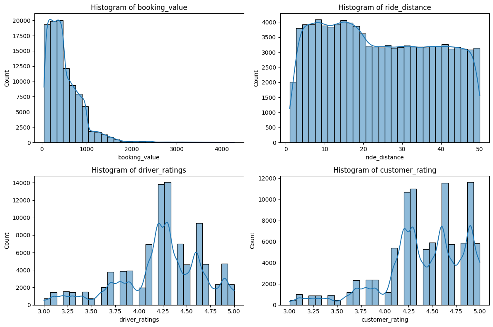
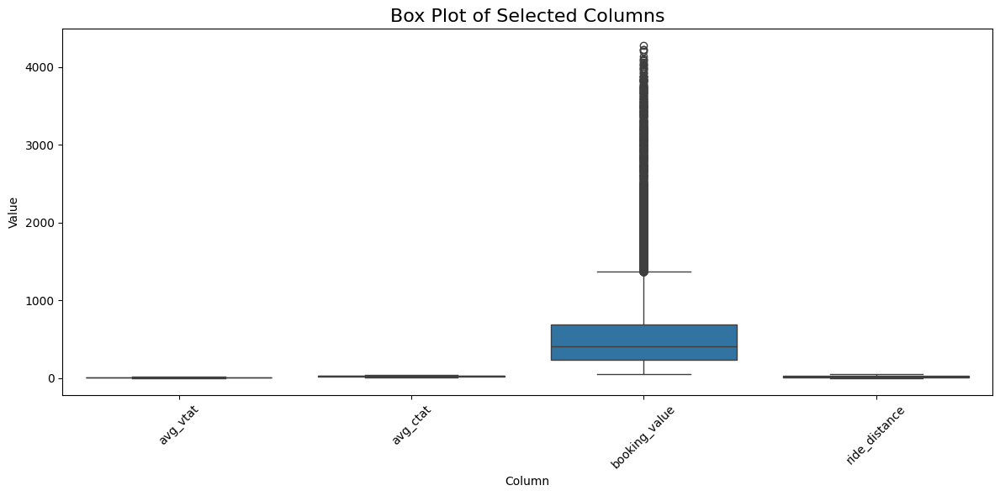

# 🚖 [UBER] Preprocessing and General Analysis

This comprehensive dataset contains detailed ride-sharing data from Uber operations for the year 2024, providing rich insights into booking patterns, vehicle performance, revenue streams, cancellation behaviors, and customer satisfaction metrics.

## 📊 Dataset Overview

- **Rows:** 150,000
- **Columns:** 21
- **Date Range:** 2024-01-01 to 2024-12-30

**Columns:**

- `date`, `time`, `booking_id`, `booking_status`, `customer_id`, `vehicle_type`
- `pickup_location`, `drop_location`, `avg_vtat`, `avg_ctat`, `cancelled_rides_by_customer`
- `reason_for_cancelling_by_customer`, `cancelled_rides_by_driver`, `driver_cancellation_reason`
- `incomplete_rides`, `incomplete_rides_reason`, `booking_value`, `ride_distance`
- `driver_ratings`, `customer_rating`, `payment_method`

---

## 🛠️ Data Preprocessing

### 1. String Processing

All text-based columns are converted to **lowercase strings** to ensure consistency for comparison and analysis.

### 2. Data Manipulation

- Cleaning and standardizing key columns
- Creating **informative flags** for cancellations, success status, and temporal features
- Extracting **datetime features**: `datetime`, `hour`, `day_of_week`, `month`, `is_weekend`
- Preparing dataset for **analysis or modeling**

---

## 📈 Executive Summary (Median-Based)

| Metric                 | Value       |
| ---------------------- | ----------- |
| Total Rides Analyzed   | 150,000     |
| Successful Rides       | 93,000      |
| Success Rate           | 62.0%       |
| Total Revenue          | ₹47,260,574 |
| Median Ride Value      | ₹414        |
| Median Distance        | 26.0 km     |
| Median Driver Rating   | 4.30/5      |
| Median Customer Rating | 4.50/5      |
| Customer Cancellations | 10,50       |

---

## ⚠️ Missing Values Summary

| Column                      | Missing Values | % Missing |
| --------------------------- | -------------- | --------- |
| incomplete_rides            | 141,000        | 94.0%     |
| cancelled_rides_by_customer | 139,500        | 93.0%     |
| cancelled_rides_by_driver   | 123,000        | 82.0%     |
| driver_ratings              | 57,000         | 38.0%     |
| customer_rating             | 57,000         | 38.0%     |
| avg_ctat                    | 48,000         | 32.0%     |
| booking_value               | 48,000         | 32.0%     |
| ride_distance               | 48,000         | 32.0%     |
| avg_vtat                    | 10,500         | 7.0%      |

**Note:** Many missing values are meaningful (e.g., cancellations, incomplete rides). They are **preserved**, not dropped, to maintain accurate context.

---

## 📊 Data Distribution

- **Ratings:** Skewed toward higher values
- **Booking Value:** Right-skewed, some lower-end outliers
- **Ride Distance:** Mostly uniform with a slight skew around 10–20 km

---

## ⚠️ Outliers

| Column        | Outliers | % Outliers |
| ------------- | -------- | ---------- |
| booking_value | 3,435    | 2.3%       |
| avg_vtat      | 0        | 0.0%       |
| avg_ctat      | 0        | 0.0%       |
| ride_distance | 0        | 0.0%       |

**Note:** Outliers are preserved since they reflect **real booking behavior**.

---

## 🔍 Why Not Drop Missing Values or Outliers?

- **Missing Values:** Some NULLs indicate meaningful scenarios (e.g., no cancellation, no rating), dropping them would remove valuable context.
- **Outliers:** These often represent genuine high- or low-value rides and are important for analysis.

---
